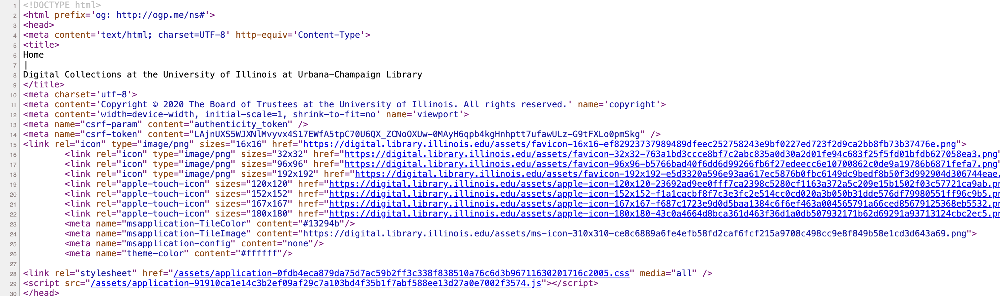

# Assignment | January 30th, 2024
## Assignment 1: Inspecting the Web
I inspected UIUC Library, which used HTML, CSS, and JavaScript. https://digital.library.illinois.edu/ \
I found a UIUCLibrary Github repository. https://github.com/UIUCLibrary \
Unfortunately, I couldn't access to the list of contributors. \
It seems like faculties of University of Illinois involved in this project. \
Yet, I could find one contributor named Henry Borchers, Digital Library Technical Coordinator at University of Illinois at Urbana-Champaign. \
In this repository, Python, PHP, Ruby, Groovy, and Powershell are used. \
